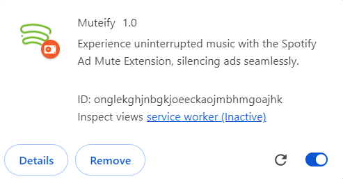

# Muteify

<h3 align="center"></h3>

## Description:
The Spotify Ad Mute Extension is a handy Chrome extension designed to enhance your listening experience on Spotify by automatically muting ads that interrupt your music playback.

## Features:
- Seamless integration: Once installed, the extension works silently in the background, muting ads without any manual intervention.
- Uninterrupted listening: Enjoy your favorite tracks on Spotify without being disturbed by pesky advertisements.
- Easy to use: Simply install the extension and let it do the work for you. No complex setup or configuration required.

## Installation:
1. **Download the Zip File**:
   - Visit the GitHub repository.
   - Click on "Download ZIP".

2. **Unzip the File**:
   - Extract the downloaded file.

3. **Install the Extension**:
   - Open Chrome and go to `chrome://extensions/`.
   - Enable "Developer mode".
   - Click on "Load unpacked".
   - Select the unzipped folder.
## How It Works:
The extension monitors your Spotify tab and detects when an ad starts playing. It then mutes the tab temporarily to silence the ad, allowing you to continue listening to your music uninterrupted.
